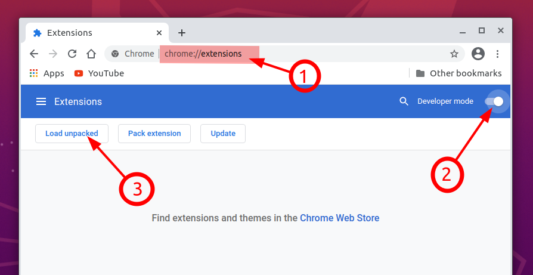
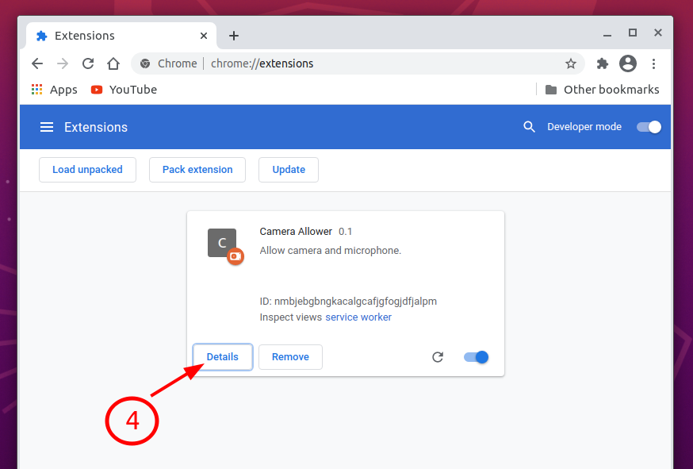
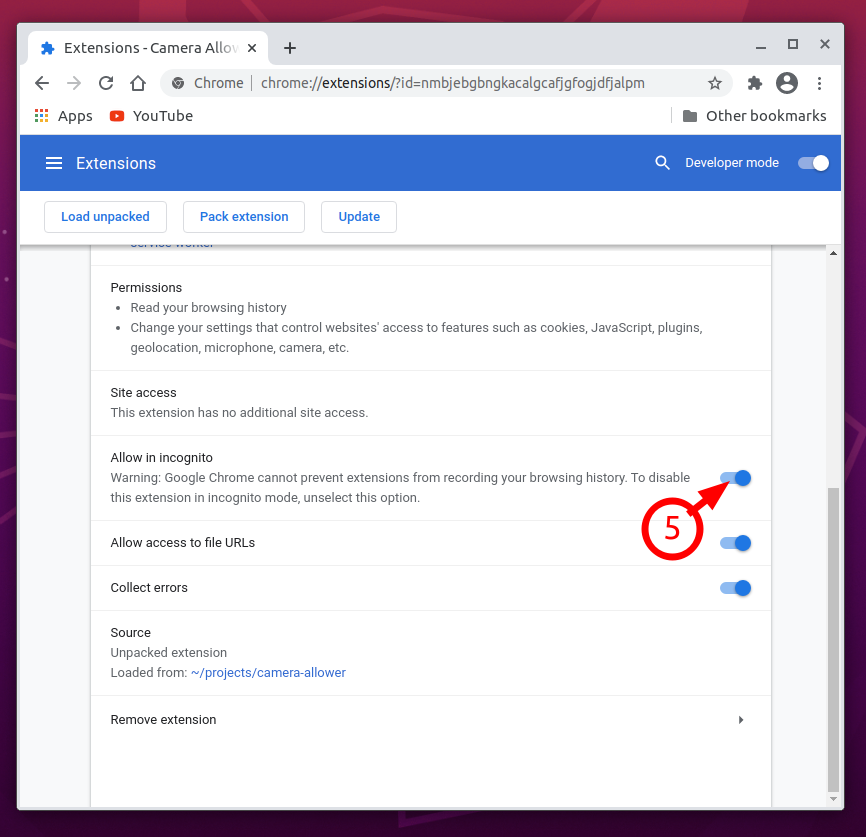
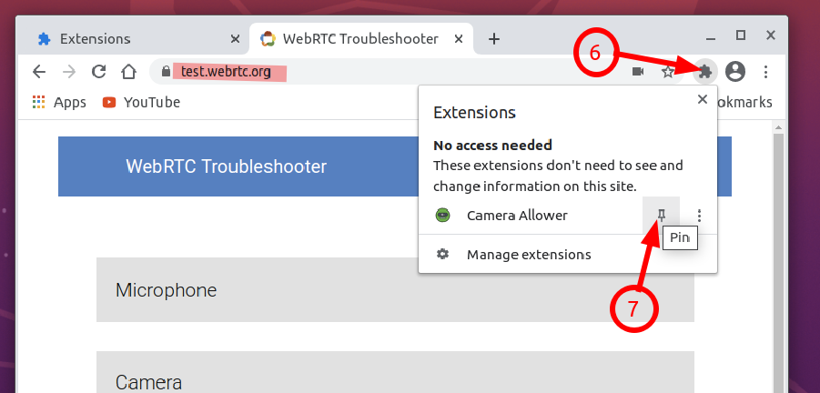
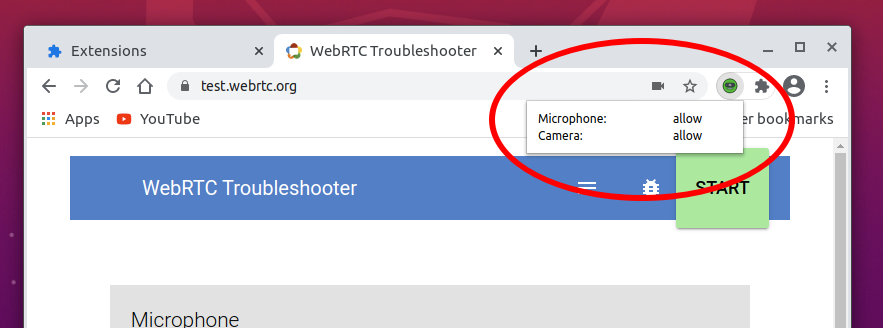
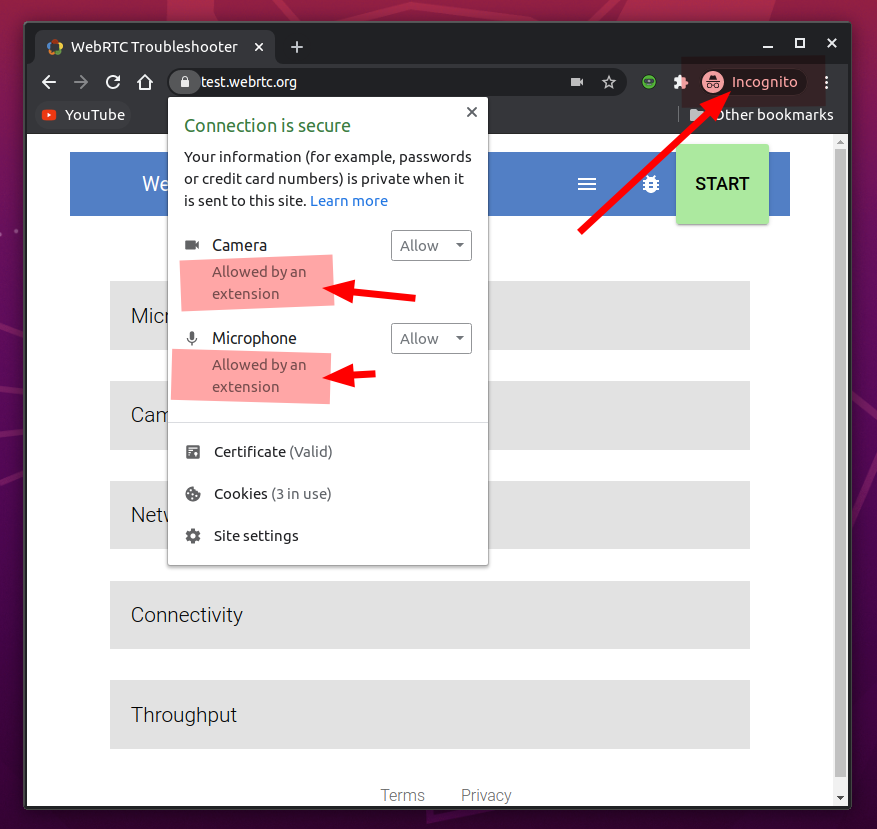

# chrome-camera-allower
Chrome extension for auto-allow camera and microphone (incognito mode supported).  

This extension provide to allow camera and microphone in automaticle mode - without user click. It is very useful when you test you code in incognito mode.

> ---
> **IMPORTANT:** 
> 
> This extension configured to work only with domain **"https://*.webrtc.org"**
> See below to config for your domain.
> 
> ---


## How to install
- Download files to you local folder.
- Open chrome browser and follow picture instructions:



> 1. type the url: "chrome://extensions/"
> 2. Activate "Developer mode"
> 3. Click on "Load unpacked"

- Choose folder with extension files.
- Congratulations!!! Extension was installed.

### Config for incognito mode
- follow picture instructions:



> 4. Click on "Details"
> 5. Scroll down and click "Allow in incognito".



### Set extension's icon to panel (optional)
- follow picture instructions:



> 6. Click on "chrome extensions" icon
> 7. Click on "Pin" icon


## Extension "chrome-camera-allower" installed and working
The icon can have 3 options:
1. Red - Camera or mickrophone is blocked
2. Green - all is allowed
3. Grey - Extension is not work.

You may click to icon to see details.



# Test
Visit web-site "test.webrtc.org" for test extension:



# Config to your domain
This extenasion works on **"https://*.webrtc.org"** only.  

For work on another domain change two files:

1. File "background.js" line 1:
```javascrit
const MY_DOMEN = 'webrtc.org';
```

2. File "popup.js" line 1:
```javascrit
const MY_DOMEN = 'webrtc.org';
```
